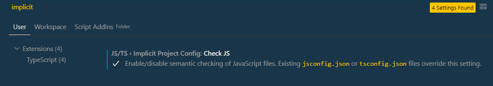
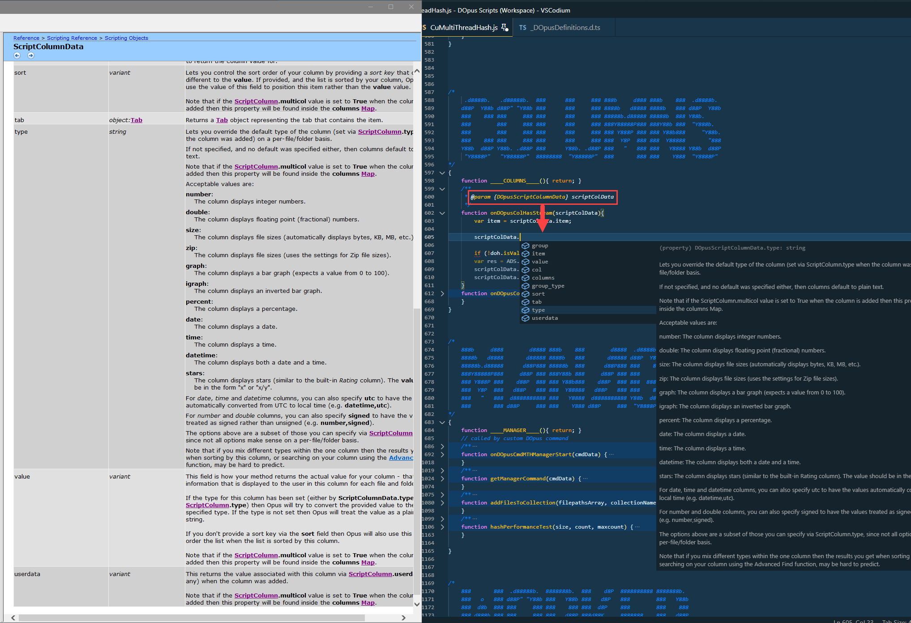
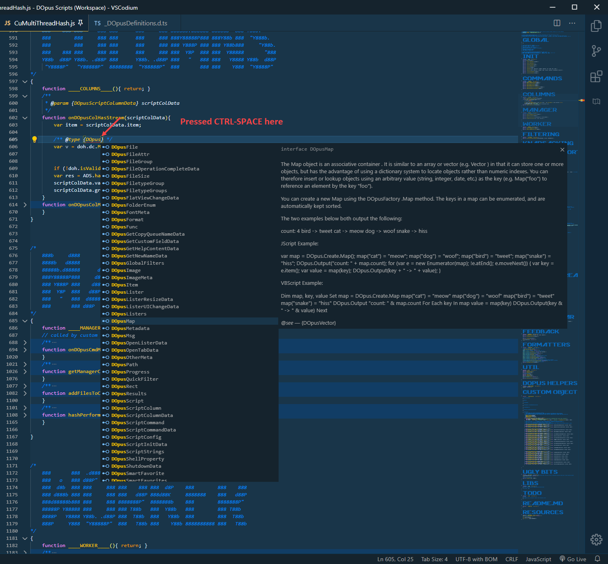
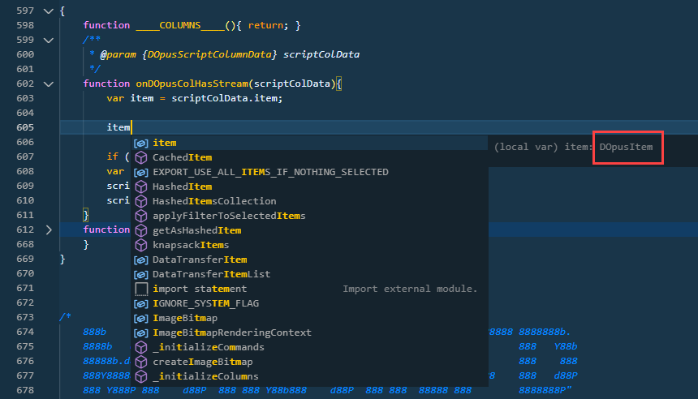
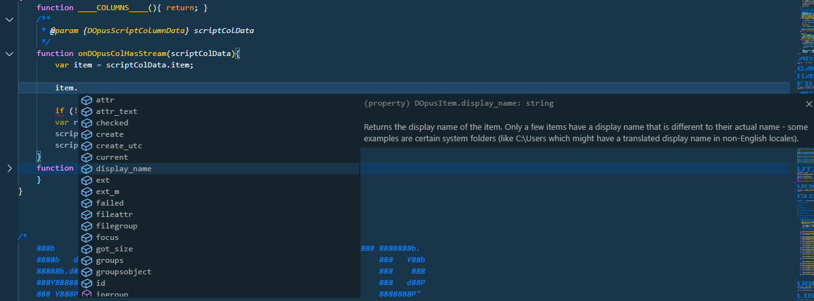
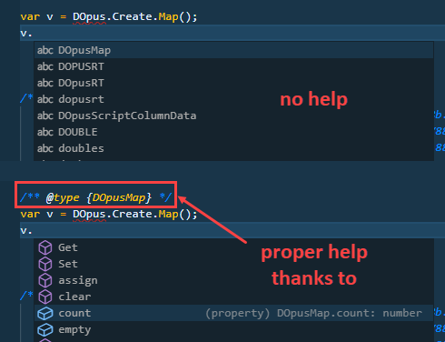

# DOpus_ScriptingHelper

The TypeScript definitions for the Scripting Objects to be used in VSCode & similar, for the excellent file manager [Directory Opus](https://www.gpsoft.com.au/).

The DO developers accepted my humble request regarding [new Get()/Set() methods for the Map object](https://resource.dopus.com/t/set-method-for-map/37775/2). So I decided to pay my thanks to the developers and to the community, from which I benefitted greatly over the years.

Unlike the name suggests, you don't have to learn TypeScript. TS can parse JavaScript as well and your scripts will still be good (*cough*), old JScript. If you are used to develop with [JSDoc](https://jsdoc.app/), JavaDoc and similar, you'll feel right at home! In fact, you will enjoy developing DOpus despite lacking a debugger.

## Setup

You need VSCode or similar; I prefer [VSCodium Portable](https://portapps.io/app/vscodium-portable/).

* First if you haven't done so, activate JS/TS › Implicit Project Config: Check JS in user settings:

  

* Copy the .d.ts file to your scripts directory.

* Put this at the top of your user script:

  `///<reference path="./_DOpusDefinitions.d.ts" />`

  `// @ts-check`

* Done!

Now all objects in the Scripting Objects section are at your disposal; except where it's not valid JS, e.g. imageMeta.35mmfocallength because it starts with a number and so on.

## In Practice

You can describe any object with standard JSDoc comments, e.g. `@param {type}`, `@returns {type}`, etc. and will have access to all defined properties of that object.

This is not a JSDoc tutorial but let's get you started. Ping me on DOpus forums if you need more help.

For example, there is DOpusScriptColumnData definition which includes the column data definitions

`/**`

` * @param {DOpusScriptColumnData} scriptColData`

 `*/`

`function onDOpusColHasStream(scriptColData){`

`// type the following and press and ctrl-space`

`// scriptColData.`

`}`

If you add the JSDoc @param line (note the /** */ -- it's not /\* */), you can access all the attributes and methods of ScriptColumnData object. JSDoc comments can also be all in a single line if you prefer.

If you define a variable of your own, you can either force the expected type via a JSDoc @type instruction, as below:

...or if VSCode/TypeScript can already infer the type from your methods & variables, it will get more and more comfortable.

For example as we declared the type of scriptColData, VSC can deduce scriptColData.item is a DOpusItem now:

...and you can access the item's attributes & methods directly:

If VSCode cannot infer it or does incorrectly you can help it via adding `/** @type {DOpusXXX} */` in front of it:

## Help needed

**Pull requests are welcome.** I don't know much about collaborating on GitHub but we'll figure it out.

I am a complete, total, bloody newbie in TypeScript. If you are a better TypeScript expert than me (not a very high threshold heh), your feedback and help is most welcome! Just submit your pull request, or maybe you'll get commit rights, we'll see from there.

If you are not a TS guru, you can still help. Any formatting help or adjusting the attribute's readonly flags, return values, etc. still need to be adjusted.

## Notes

This is a very early stage project. Some or none of features may work for you.

Now all the little details:

* **All DOpus objects are prefixed with DOpus** - I do not intend to change this at the moment.
* Probably the most important one: **The DOpus and DOpusFactory objects are not available yet!**
* JavaScript is case-sensitive so **all method names are defined twice**: Once as defined by DOpus, e.g. `item.ShellProp` and once in lower-case, e.g. `item.shellprop`. Since I try to stick to common JS developing styles and did not want to use `item.Open()` but rather `item.open()`, I chose doing so. The `InitialCapNames()` are used generally only for constructor methods. Other than the case, the method pairs are completely identical. Choose your pick.
* The "default value" of some objects, e.g. FilePath, is very JavaScript-unlike. In such cases, I defined the object with "`DOpusFilePath extends String`". For all intents and purposes `item.filepath` behaves like a string, but **you might occasionally force some method** which accepts only string to accept a filepath with `myFunction(''+item.filepath)`.
* **Most attributes are defined to be read-only... at the moment.** But that will improve over time. The information whether a field is readonly (e.g. a file's size) or changeable (e.g. a column's value) is unfortunately in the remarks column in the help file. My parser is not an AI which can deduce that, so adjusting these will be an ongoing manual effort.
* This was not easy as it seemed. It's the product of ca. 15 hours of work: a lot of JS debugging and many manual corrections. I had to decompile the DOpus.chm file and parse every object's file individually using a Tampermonkey script (which will be uploaded later). Because even the slightest inconsistencies between the files, like formatting, a's within strong's or strong's within a's, different notations or a very obscure constellation broke my parser. So **not everything looks perfect.**
* The file dos not pass ESLint & JSHint checks yet, but before fixing it, I want to test the latest beta with the new Map methods.
